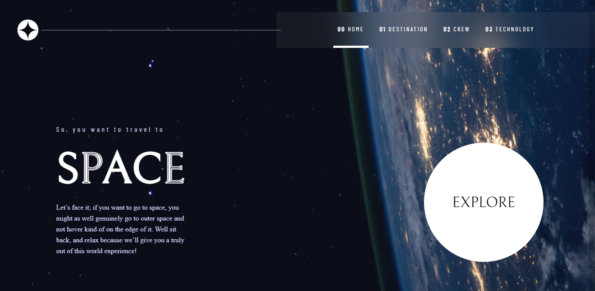

# Frontend Mentor - Space tourism website solution

This is a solution to the [Space tourism website challenge on Frontend Mentor](https://www.frontendmentor.io/challenges/space-tourism-multipage-website-gRWj1URZ3). Frontend Mentor challenges help you improve your coding skills by building realistic projects.

## Table of contents

- [Overview](#overview)
  - [The challenge](#the-challenge)
  - [Screenshot](#screenshot)
  - [Links](#links)
- [My process](#my-process)
  - [Built with](#built-with)
  - [What I learned](#what-i-learned)
  - [Continued development](#continued-development)
  - [Useful resources](#useful-resources)
- [Author](#author)
- [Acknowledgments](#acknowledgments)

## Overview

### The challenge

Users should be able to:

- View the optimal layout for each of the website's pages depending on their device's screen size
- See hover states for all interactive elements on the page
- View each page and be able to toggle between the tabs to see new information

### Screenshot

### Links

- Solution URL: [Add solution URL here](https://github.com/louis-bamidele/project1-spaceTourismWebsite)
- Live Site URL: [Add live site URL here](https://louis-bamidele.github.io/project1-spaceTourismWebsite/index.html)

## My process

### Built with

- Semantic HTML5 markup
- CSS custom properties
- Flexbox
- CSS positioning
- Mobile-first workflow
- JavaScript

**Note: These are just examples. Delete this note and replace the list above with your own choices**

### What I learned
I learnt a lot while working through this project. I would love to show you the codes I'm proud of but I can't really decide which code specifically, because I'm proud of all these codes. I had to make Researches on how to use flexbox and grid very well, was also having issues with other CSS properties but thanks to some blog post I would provide links to those post below.  

### Continued development
I would really love to learn more on CSS grid and flexbox, I only understand the basics and I would love to understand more so I can confidently use them on layout on other webpages I would work on.

### Useful resources

- [link to css flexbox](https://css-tricks.com/snippets/css/a-guide-to-flexbox/) - This helped me understand flexbox. I really liked this pattern and will use it going forward.
- [link to css layout article](https://developer.mozilla.org/en-US/docs/Learn/CSS/CSS_layout/Flexbox) - This is an amazing article which helped me finally understand flex. I'd recommend it to anyone still learning this concept.

## Author

- name - 
- Frontend Mentor - [@yourusername](https://www.frontendmentor.io/profile/louis7734)
- Twitter - [@yourusername](https://www.twitter.com/bamidele_louis)

## Acknowledgments
